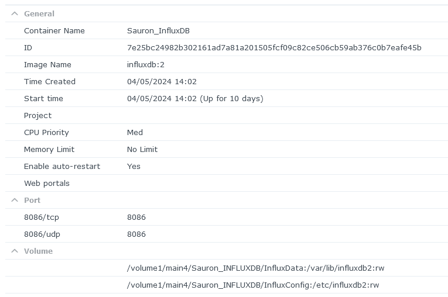
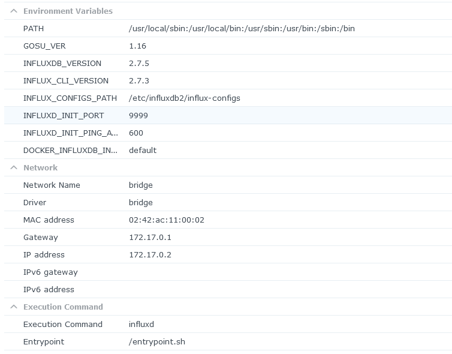
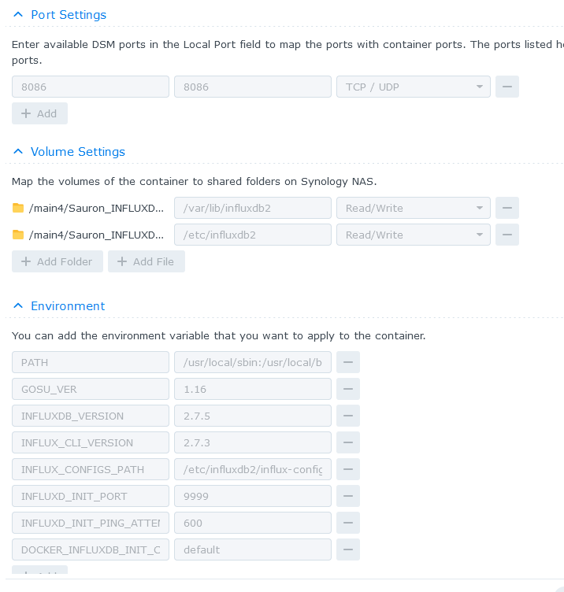
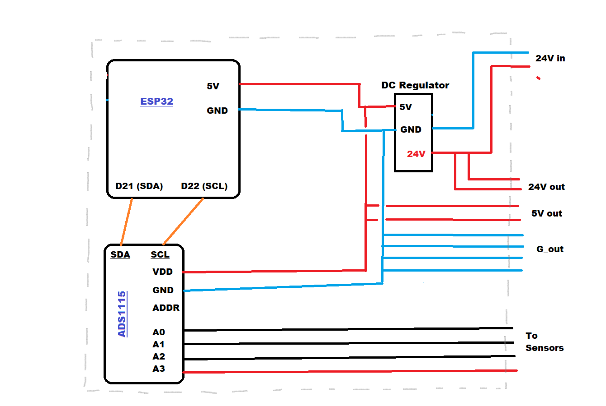
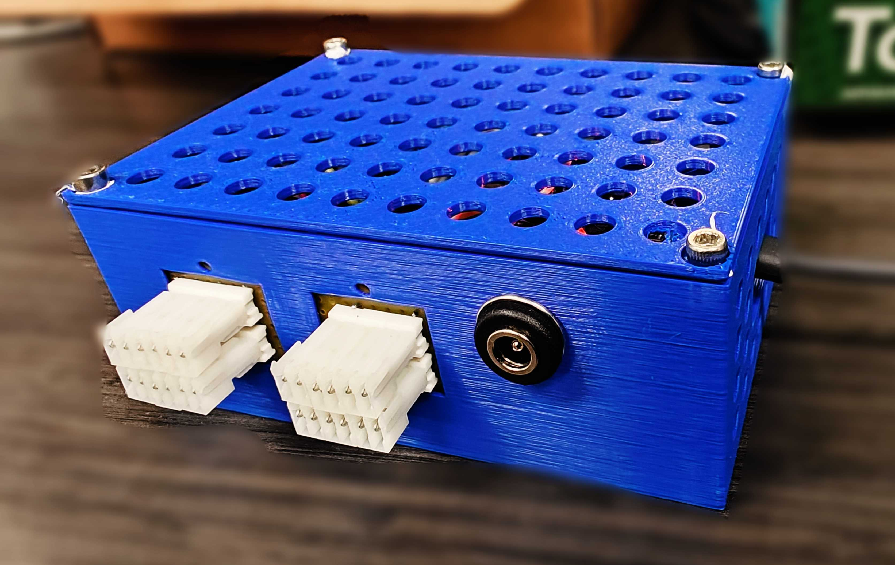

The monitoring system 'Sauron' is used to log data like wall electricity voltages, air pressures, moisture in the lab onto a database. A dashboard then queries data from this database and displays data and issues alerts if a set value goes below some threshold. This is a non-comprehensive guide on how to build this system.

The basic setup is the following:

Sensor  --0-5V-->  ADS115  ---I2C-->  ESP32  --Wi-Fi-->  Raspberry Pi  --log-->  InfluxDB  --->  Grafana

1. The sensor is read by an external ADC (ADS1115, a 16bit 5V 4channel ADC). This data is read by the ESP32 through I2C.
2. The measured data is transferred to the Raspberry Pi over Wi-Fi by established always-on TCP sockets.
3. The Raspberry Pi receives this data and promptly logs it to a database 'InfluxDB' which is a database optimized for storing time series.
4. Finally, a dashboard (Grafana) implements all data queries, plotting, and alerting if anything goes wrong.


To set up the Sauron follow the guide starting from [Steps to follow - Rpi](#Steps-to-follow---Rpi).

---

Implementation details for each of the working entities is below:


## Raspberry Pi
Relevant Links:
[A beginner guide](https://raspberrypi-guide.github.io/raspberry-pi)
[Official Documentation](https://www.raspberrypi.com/documentation/) - (read hardware and getting started)

There are multiple guides other than this on Rpi's capabilities and usage. We only require a headless install, which is faster, lighter and leaves for space for data storage.
#### Steps to follow - Rpi:

1. Install headless Raspbian on a SD Card using [Raspberry Pi Imager](https://github.com/raspberrypi/rpi-imager) with options of - SSH enabled, a user/pass of choice and hostname of choice.  Plug the SD Card in Pi board, and power on. For this step any [guide](https://raspberrypi-guide.github.io/raspberry-pi) on the internet can be followed.
2. Connect Pi to a PC with Ethernet, and open terminal on the PC. Issue `ssh <user@hostname.local` - with the values chosen above - after which it should ask for confirmations and finally a password. Completing this step should give you access to the terminal on the Raspberry Pi.
3. From here on all commands below will be issued in the RPi terminal. Commands issued in this terminal may require the same password set above:
4. Enable I2C : Issue `sudo raspi-config` and navigate to 'Interface Options' → I2C → enable.
5. Install Pip : Issue command ```sudo apt install python3-pip```
6. Install [RShell](https://github.com/dhylands/rshell) : Issue `pip install --break-system-packages rshell`
7. Install Chrony : Check out [Setting up NTP server](#Setting-up-NTP-server)
8. Setup Wi-Fi AP for ESP32 to connect : Check [Setting-up-Wi-Fi-Hotspot](#Setting-up-Wi-Fi-Hotspot)
9. Setup InfluxDB : [Setting up InfluxDB](#Setting-up-InfluxDB)
10. Setup ESP32 :  Follow [ESP32](#ESP32)
11. Setup Grafana: [Setting up Grafana](#Setting-up-Grafana)
12. [Final steps for seamlessness](#Final-Steps-for-seamlessness)

Finally, run the ESP32 and run the python server script and watch grafana being updated with relevant data.
```
nuhup python <pythonfilename.py> &

```

To kill this python process, `killall python` can be issued.
Optionally, alerts for slack/emails can also be setup using [grafana incident manager](https://grafana.com/docs/grafana-cloud/alerting-and-irm/alerting/).

#### Setting up Grafana

Follow the guide and install the stable release of Grafana OSS [Grafana Installation guide](https://grafana.com/docs/grafana/latest/setup-grafana/installation/debian/)

Start the grafana server:

```
sudo systemctl enable grafana-server
sudo systemctl start grafana-server
```

Then run `ifconfig` and use the ip/inet valuie under eth0 below:
On your PC, open the browser and go to address `http://localhost:3000` .
the initial user and pass is `admin`.

Setup InfluxDB data source from [here](https://grafana.com/docs/grafana/latest/datasources/influxdb/) and [influxdocs](https://docs.influxdata.com/influxdb/v2/tools/grafana/).
Finally setup a [dashboard](https://grafana.com/docs/grafana/latest/dashboards/) to display that data.

Feel free to explore the entire documentation of Grafana OSS as it is feature packed. Check out alerting as it can be useful for the lab.

#### Setting up Wi-Fi Hotspot

We need to set RPi up as a wireless network AP (or a Wi-Fi hotspot) to allow ESP32 clients to communicate with the Pi. All commands below are to be followed in a serial order.

To effectively manage the AP we need some packages installed. Issue command

```
sudo apt install dnsmasq hostapd dhcpcd
```

Now we will configure a static IP for the Wi-Fi interface. We will assign it to be '192.168.4.1'. Issue:

```
sudo nano /etc/dhcpcd.conf
```

and at the end of the file add:
```
interface wlan0
    static ip_address=192.168.4.1/24
    nohook wpa_supplicant
```

Save (Ctrl+S) and exit (Ctrl+X). Issue:

```
sudo service dhcpcd restart
```

Now we configure the DHCP server below:

```
sudo mv /etc/dnsmasq.conf /etc/dnsmasq.conf.orig
sudo nano /etc/dnsmasq.conf
```
add the following lines:
```
interface=wlan0
dhcp-range=192.168.4.2,192.168.4.50,255.255.255.0,24h
```
This will allow 50 devices to connect at a time and assign them an IP between 2 and 50.

```
sudo systemctl start dnsmasq
```

Now we will set up our Access Point:
```
sudo nano /etc/hostapd/hostapd.conf
```

Add the following text in the file and save. Feel free to change the SSID and passphrase fields to any desired value. This will be the name and pass of the Wi-Fi hotspot.
```
country_code=US
interface=wlan0
ssid=sauron_monitor_wifi_name
channel=9
auth_algs=1
wpa=2
wpa_passphrase=sauron_monitor_wifi_pwd
wpa_key_mgmt=WPA-PSK
wpa_pairwise=TKIP CCMP
rsn_pairwise=CCMP
```
We now need to tell the system where to find this configuration file. Open the hostapd file:
```
sudo nano /etc/default/hostapd
```

Find the line with `#DAEMON_CONF`, and replace it with this:

```
DAEMON_CONF="/etc/hostapd/hostapd.conf"
```


Run the following commands to enable and start hostapd:

```
sudo systemctl unmask hostapd
sudo systemctl enable hostapd
sudo systemctl start hostapd
```

At this point you should see the Wi-Fi from Raspberry Pi on your phone with the SSID set, and should be able to connect with the password set.

We can allow for clients to be able to access the internet (granted the Pi has internet) by enabling IP forwarding. While we don't need that, If needed for a specific application follow [this](https://raspberrypi-guide.github.io/networking/create-wireless-access-point#enable-routing-and-ip-masquerading).


#### Setting up InfluxDB

Relevant Links :
[Docs](https://docs.influxdata.com/influxdb/v2/install/)
[Python library](https://influxdb-client.readthedocs.io/en/latest/)

Note : For the Hatlab, InfluxDB lives on the NAS. For steps relevant to the hatlab, follow [this instead](#Setting-up-InfluxDB-on-NAS).
This guide is about influxDB v2. V3 is about to come out and may change some things. Follow carefully.

Install InfluxDBv2:
```
curl https://repos.influxdata.com/influxdata-archive.key | gpg --dearmor | sudo tee /usr/share/keyrings/influxdb-archive-keyring.gpg >/dev/null

echo "deb [signed-by=/usr/share/keyrings/influxdb-archive-keyring.gpg] https://repos.influxdata.com/debian stable main" | sudo tee /etc/apt/sources.list.d/influxdb.list

sudo apt update

sudo apt install influxdb2

sudo systemctl enable influxdb
```


The data input will be stored in `/var/lib/influxdb`. Typically, a 1-month dataset for one ESP32 would be 500MB, so retention policy in the server python code can be modified accordingly.

We now setup influx for use:
```
influx setup
```
this will open an interactive setup process where we setup a username, password, organisation name, bucket name. Get the API admin token and store in a safe place. All these details will be needed later.

```
influx auth list --json | grep "token"
```


Finally, install the python library :
```
pip install --break-system-packages influxdb-client
```
#### Setting up InfluxDB on NAS

The synology NAS004 already has an influxdb database on the main drive.

If in case it needs to be reinstalled, use docker(or container manager on synology apps) to install influxdb with the following options:




The access tokens for the databse are:

admin token:

"LctRigxR5euXGvWcT87H7DRCufnrFzARc7XVY2-f7CtKbuYkTTh9RqzZ8u52N-W2zbJ2LQqAEa_l3LdHoJOYhA=="


all access python token:
"WtGwDdgSYadjOPGtqdqJFZiy64tPpAZITWIGRpRIZzcbHvG2p_Bp5PKT-zL3bzaN_8u6TmTnkNm8RguN1OgrKA=="

User and pass for logging into the influxdb : hatlab, hatlab43va

#### Setting up NTP server
It is important that all components that measure real time data keep accurate time. Since the clocks on board are only about 50ppm accurate, we expect the time to go off by a minute every month. This is true for both the Pi and the ESP32 MCUs. We use [Chrony](https://chrony-project.org/index.html) which is a NTP server and a client i.e. serves time to ESP32 and gets its own time from atomic clocks on the internet.

To configure chrony, install it first:
```
sudo apt install chrony
```

Then allow it to act as a server:
```
echo 'allow 192.168.4.1/24' | sudo tee -a /etc/chrony/chrony.conf
sudo systemctl enable chronyd
sudo systemctl restart chronyd.service
```

Set the correct time zone and check that system time is synced :

```
timedatectl set-timezone "America/New_York"
timedatectl
```
Should show 'System clock synchronized: yes'.


## ESP32

Relevant Links:
[Micropython](https://docs.micropython.org/en/latest/index.html)
[ESP32 Expressif Documentation](https://docs.espressif.com/projects/esp-idf/en/latest/esp32/index.html)
[Rshell](https://github.com/dhylands/rshell)

#### Steps to follow:

We need to install Micropython on the ESP32 and be able to access the terminal to move files and program it correctly. In our case we use a ESP32-WROOM.

First, install esptool and rshell in the Raspberry Pi:
```
sudo pip install --break-system-packages rshell esptool
```

Then download the relevant bin file from [here](https://micropython.org/download/). Select the correct port/device, which in this example case is the ESP32-WROOM. After finding the correct link o the bin file, in RPi terminal issue replacing the `<link>` :

```
curl <link> >> firmware.bin
```

Then, we use the esptool to burn the firmware onto the chip:
```
esptool.py --chip esp32 --port /dev/ttyUSB0 erase_flash

esptool.py --chip esp32 --port /dev/ttyUSB0 --baud 460800 write_flash -z 0x1000 firmware.bin
```


At this point, assuming nothing resulted in a failure, and the correct firmware was burned, the ESP32 should be running Micro python.  Before going into the ESP32's terminal,, we  place the files required on the ESP32 in our Raspberry Pi future use. These are the 'ESP32_client_files' in github/project folder. Make relevant changes in these files by following [Modifying the ESP32 files](#Modifying-the-ESP32-files)  and come back here.

```
mkdir ./esp32clientfiles && cd esp32clientfiles
```

Copy the esp32 client files in the folder either by using a USB or using [scp](https://linuxize.com/post/how-to-use-scp-command-to-securely-transfer-files/).


We can now connect through rshell:

```
rshell --buffer-size=2048 -p /dev/ttyUSB0
```

We should now be inside the ESP32's terminal. All files on the ESP32 board are in the /'pyboard/'.
The python repl can be accessed by issuing `repl`.

We now place the files required on the ESP32:

```
cp ./esp32clientfiles/*.py /pyboard/
```

To ensure that everything is in working order, go to the REPL, and restart the ESP32 by pressing the physical boot button on the ESP32. You should see that the wifi connects. At this point, the ESP would throw an error as it cannot find the ADC as it hasn't been connected. Follow the pinout diagram given below and connect the ADS1115 [ADS1115](#ADS1115).

Run the script again and make sure everything runs smoothly, and now the failure point is 'retrying socket connection'.
##### Pinout:






The DC regulator was added because most industrial grade sensors use 24V. Some voltage outputs have also been provided for powering the sensors.

##### High (time) resolution measurements
The code included in the package  can measure and transmit every 100ms or so, mostly limited by the measurement speed of the external ADC. It is advisable to bunch up multiple measurements and then send it to the Raspberry Pi in order to avoid network congestions and packet loss. This can be easily done as simply an addition to the `buffer_str` variable that gets routed to the socket.

##### Clock:
The ESP32 transmits data containing the `time_of_the_measurement meas_1 meas_2 meas_3 meas_4`. It needs to do this over months. The clock on ESP32 is about 50ppm by spec. This means that it should lose about 50 seconds in a month. However, this error at least an order of magnitude larger than in real life, probably because the DC supply has noise. Therefore, the onboard clock needs to be recalibrated periodically. This is easily achieved by [[Guide - Sauron#Setting up NTP server| hosting a NTP server | ]] on the Pi and setting up a timesync method on the ESP32 to routinely adjust the time according to the NTP server. This is done by calling methods in the `machine.RTC()` module in [micropython](https://docs.micropython.org/en/latest/library/machine.RTC.html).
### ADS1115

Relevant Links:
[Datasheet](https://cdn-shop.adafruit.com/datasheets/ads1115.pdf)

The ADS1115 is a 16-bit 4 channel ADC. Connect the ADS with a 5V power, GND, SDA, SCL follwing the ESP32 pinout given above and A0--A3 channels to the appropriate sensors.
### Code Guide:

#### Modifying the ESP32 files:
ESP32 client files are the following:
```
ntpupdate.py  # has scripts to update the time
main.py       # Connects to the wifi and runs basic checks
ADS1115.py    # driver for external 12bit ADC
ADS_singleshot_singlepub_timestamped.py  # script that runs the clinet and publishes data to RPi
```
Only two files need to be modified according to need:
1. `main.py` : Modify line 10 to add the name and pass of raspberry Pi AP/hotspot while following [Setting up Wi-Fi Hotspot](#Setting-up-Wi-Fi-Hotspot) .
2. `ADS_singleshot_singlepub_timestamped.py` :
	1. Modify line 13 to the IP of the raspberry pi wifi adaptor. If the guide [Setting up Wi-Fi Hotspot](#Setting-up-Wi-Fi-Hotspot) was followed without any changes, this step can be skipped.
	2. Modify line 16 to the address of the external ADC.
	3. Modiy line 42 to the address, port, wifi_name and wifi_pwd set while follwoing [Setting up Wi-Fi Hotspot](#Setting-up-Wi-Fi-Hotspot) . The port can be anything greater than 1023 can be chosen. Remember the chosen port. THIS NEEDS TO BE DIFFERENT FOR EACH ESP32 CONNECTING TO THE RPI.
	4. Modify line 63 to the measurement frequency desired. This code was tested for 100ms frequency and works fine. However, in this case, modify the code to append to buffer strings and send multiple data points together as it prevents network congestion.

#### Modifying the RPi server files:

There is not much need for changes, except a few key changes:
```
PORT=65433, # maps to the sensor. One port for each sensor
SENSOR_NAME = 'sensor1',
measurement_name_list = ['v1_Volts','v2_percent','v3_celsius','v4_psi'],
IP="192.168.4.1", # IP of the wifi network adaptotr
LOG_LEVEL=logging.INFO,
INFLUX_WRITE = True,
DATA_WRITE = False,
NUM_OF_ADC = 1,
INFLUX_ORG_NAME = 'hatlab',
INFLUX_TOKEN = 'dfghjdfghfg563473456fseg3456y6'
```

Change the port number to whatever was selected as the port while following [Modifying the ESP32 files](#Modifying-the-ESP32-files)
The sensor name should change to whatever you want to name the sensor, say, 'watertemp-waterpres-airtemp-airpress'.
`DATA_WRITE` controls the writing of text files locally for a longer remote storage if needed. Data path can be changed in line 35. If you'd like for InfluxDB to keep all data forever, modify the retention rules in line 55.

`INFLUX_ORG_NAME` & `INFLUX_TOKEN` should be modified to the organisation name set and token obtained while following [Setting up InfluxDB](#Setting-up-InfluxDB).


#### Final Steps for seamlessness

After adding datasources and setting up dasboards as necessary, it is advisable to add grafana alerting to the system.

Other than alerting, it is important that the sauron system restarts itself in the event of a restart/powerloss automatically. For that we can use systemd:

Make a file with `sudo nano /etc/systemd/system/run_sauron.service`
and add the following content to it (making relevant changes as necessary ofcourse):

```
[Unit]

Description=Runs Sauron
[Service]
User=hatlab
Type=simple
Restart=on-failure
ExecStartPre=/bin/sleep 30
ExecStart=/usr/bin/python /home/hatlab/Sauron_TCP_server_files/server_voltage_pressure_aja.py


[Install]
WantedBy=multi-user.target
```
and issue `sudo systemctl enable run_sauron.service`. This will ensure that the python server restarts everytime it fails and on reboot.